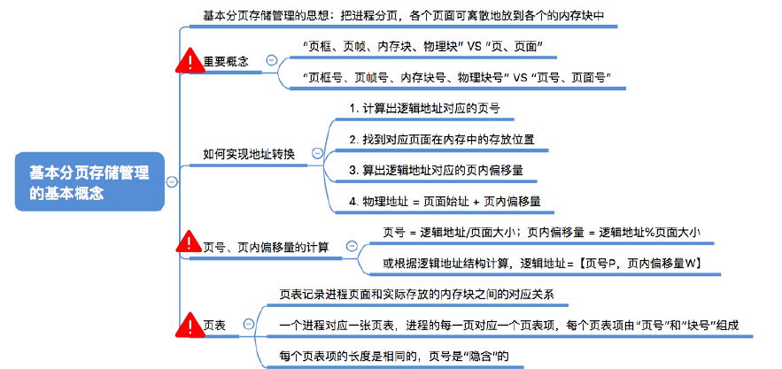
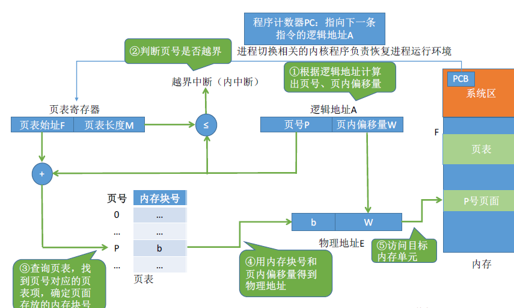
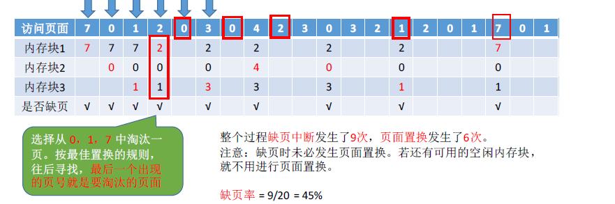

[TOC]

# 内存

## 内存基础知识

1. 什么是内存，有何作用？

   内存是用于存放数据的硬件，程序执行前需要先放到内存中才能被CPU处理。

2. 进程运行的基本原理

   1. 指令的工作原理

      代码要翻译成CPU能识别的指令。这些指令会告诉CPU应该去内存的哪个地址存取数据，这个数据应该做什么样的处理。实际生成机器指令的时候并不知道该进程的数据会被放到什么位置，所以编译生成的指令一般是使用**逻辑地址。**

   2. 逻辑地址VS物理地址

      **相对地址又叫逻辑地址，绝对地址又叫物理地址。**

   3. 从写程序到程序运行：编辑-编译-链接-装入

      1. 编译：有编译程序将用户源代码编译成若干个目标模块（也就是把高级语言翻译成低级语言）
      2. 链接：有链接程序将编译后形成的一组目标模块，以及所需要的库函数链接在一起，形成一个完整的装入模块
      3. 装入：有装入程序将装入模块装入内存运行。

   4. 三种链接方式

      	1. 静态链接：在程序运行之前，先将各目标模块以及他们所需要的库函数连接成一个完整的可执行文件（装入模块），之后不再拆开
      	2. 装入时动态链接：将各目标模块装入内存时，边装入边链接的链接方式
      	3. 运行时动态链接：在程序执行中需要该目标模块时，才对他进行连接，优点是便于修改和更新，便于实现目标模块的共享。

   5. 三种装入方式

      装入模块中的指令地址指的是”相对地址“，也就是下相对于开始地址而言的地址，相对地址也叫做逻辑地址。

      三种方式：

      1. 绝对装入（单道操作系统）：在编译时，如果**知道程序将放在内存的哪个位置**，编译程序会将产生的绝对地址的目标代码咋恍如程序按照装入模块中的地址，将程序和数据装入地址。**绝对装入只适合单道程序环境**。程序中使用的绝对地址，可以在编译或者汇编时给出，也可以有程序直接赋予。通常情况下都是编译或者汇编时再转换为绝对地址。

      2. 静态重定位（早期多道批处理阶段）：又称**可重定位装入**，编译链接后的装入模块的地址都是从0开始的，指令中使用的地址、数据存放的地址都是相对于起始地址而言的逻辑地址，可以根据内存的当前情况，将装入模块装入到内存的适当位置。装入时对地址进行“**重定位”**，将逻辑地址转换为物理地址。（地址变换是在装入时一次性完成的）

         静态重定位的特点是在一个作业装入内存时，**必须分配其要求的全部内存空间**，如果没有足够的内存，就不能装入该作业，作业一旦进入内存后，**在运行期间就不能再次移动，**也不能在申请内存空间。

      3. 动态重定位（现代操作系统）

         动态重定位又叫**动态运行时装入**，编译链接之后装入模块的地址是从0开始的，**装入程序把装入模块装入内存后并不会立即把逻辑地址转换为物理地址**，而是把地址转换**推迟到程序真正执行时才进行**。因此装入内存后所有的地址依然是逻辑地址。这种方式需要一个**重定位寄存器。**

         重定位寄存器，存放装入模块存放的**起始位置，**并且可以将程序分配到不连续的存储区中：在程序运行前只需要装入部分代码即可投入运行，然后在程序运行期间，根据动态申请分配内存；便于程序段的共享；可以向用户提供一个比存储空间大很多的地址空间。

         采用动态重定位时**允许程序在内存中发生移动。**

## 内存管理概念

1. 操作系统负责**内存空间的分配和回收**
2. 操作系统需要提供某种技术**从逻辑上堆内存空间进行扩充**
3. 操作系统需要提供地址转换功能，负责程序的**逻辑地址与物理地址的转换**
4. 操作系统需要提供**内存保护功能**，保证各个进程在各自的存储空间运行，互相不干扰

## 覆盖与交换

### 覆盖技术

早期的计算机内存很小，比如IBM推出的第一台PC机的最大只支持1MB大小的内存，因此经常出现内存大小不够的问题。

后来引入了**覆盖技术**，用于**解决程序大小超过物理内存总和的问题。**

思想：将程序分为**多个段（多个模块）**。**常用的段常驻内存，不常用的段在需要的时候调入内存**，内存分为**一个固定区与若干个覆盖区**。需要常驻内存的段放在固定区内，**调入后就不再调出**（除非运行结束），不常用的段放在**覆盖区**，**需要调用的时候调入内存，不需要是再调出内存。**

必须由程序员声明覆盖结构，操作系统会完成自动覆盖。

缺点：**对用户不透明**，增加了用户编程负担，覆盖技术只用于早期的操作系统之中，现在已经成为了历史。

### 交换技术

交换技术的设计思想：内存空间紧张时，系统将内存中的某些进程暂时**换出外存**，把外存中某些已经具备运行条件的进程**换入内存**（进程再内存和磁盘见动态调度）

**中级调度（内存调度）**就是要决定哪个处于挂起状态的进程重新调入内存。

暂时换出内存等待的进程状态为**挂起状态（suspend）**

挂起态又可以进一步细分为就绪挂起与阻塞挂起两种状态。

1. 应该再外存的什么位置保存被换出的进程？

   具有交换功能的操作系统中，通常把磁盘空间分为**文件区**和**交换区**两个部分。**文件区**主要用于**存放文件**，主要**追求存储空间的利用率**，因此对文件区空间的管理**采用离散分配方式**；**对换区**空间只占磁盘的小部分空间，被换出的进程数据就存放再交换区。由于交换的速度直接**影响到系统的整体速度**。因此交换区空间的管理主要**追求换出速度**，因此通常交换区**采用连续分配方式**。总之，交换区的IO速度比文件区的更快。

2. 什么时候应该交换？

   交换通常再许多进程运行且内存吃紧时进行，而系统负荷降低就暂停，例如：在发现许多进程运行时经常发生缺页，就说明内存紧张，此时可以换出一些进程，如果缺页率明显下降，可以暂停换出。

3. 应该换出哪些进程？

   可以优先换出阻塞进程；可以优先换出优先级低的进程；为了防止优先级低的进程在被调用内存后很快又被换出，有的系统还会考虑进程在内存中的驻留时间。（**PCB常驻内存**，不会被换出外存）

## 连续分配管理方式

连续分配指的是为用户进程分配的必须是一个连续的内存空间

### 单一连续分配

在单一连续分配方式中，内存被分为**系统区**和**用户区**，系统区通常位于内存的低地址部分，用于存放操作系统相关数据；用户区用于存放用户进程和相关数据。内存中**只能有一道用户程序**，用户程序独占整个用户区空间。

优点：实现简单**，无外部碎片**；可以采用覆盖技术扩充内存；不一定需要采用内存保护

缺点：只能用于单用户、单任务的操作系统，**有内部碎片**（分配给某进程的内存区域中，如果有些部分没有用上，就是用户碎片）；存储器利用率极低。

### 固定分区分配

为了能在内存中装入多道程序，且这些程序之间又不会互相干扰，于是将整个用户空间划分成若干个固定大小的分区，在每个分区中只能装入一道作业，这样就形成了最早的、最简单的一种可以运行多道程序的内存管理方式。

分区大小相等：缺乏灵活性，但是很**适合用于一台计算机控制多个相同对象的场合。**

分区大小不等：增加了灵活性，可以满足不同大小的进程需求。根据常在系统中运行的作业大小进行划分。

操作系统需要建立一个数据结构--**分区说明表**，来实现各个分区的分配与回收。每个表项对应一个分区，通常按照分区大小排列，每个表项包括**对应分区的大小、起始地址、状态（**是否应景分配）

当某个用户程序需要装入内存时，由操作系统内核程序根据用户大小检索该表，从中找到一个能满足大小的，未分配的分区，将之分配给该程序，然后修改状态为“已分配”。

优点：实现简单，**无外部碎片**

缺点：

1. 当用户程序太大时，可能所有的分区都不能满足需求，此时不得不采用覆盖技术来解决，但是这样会降低性能，
2. 会产生内部碎片**，内存利用率低**

### 动态分区分配

动态分区分配又称为可变分区分配，这种分配方式**不会预先划分内存分区**，而是在进程装入内存时，**根据进程大小动态的建立分区，**并使得分区的大小正好**适合进程的需要，**因此系统分区的大小和数目是可变的。

动态分区没有内部碎片但是由外部碎片。

内部碎片指的是分配了但是没有用上的

外部碎片指的是内存中的某些空闲分区太小导致难以利用。

如果内存中空闲空间的总和本来可以满足某进程的要求，但是由于进程需要的是一整块连续的内存空间，因此这些碎片不能满足进程的需求。可以通过**紧凑**技术来解决外部碎片。

1. 系统使用什么样的数据结构记录内存的使用情况？

   1. 空闲分区表：每个空闲分区对应一个表项。表项中包含**区号、**分区大小、分区起始地址等信息。
   2. 空闲分区链：每个分区的起始部分和末尾部分分别设置前向指针和后向指针。起始部分还可以记录分区大小等信息

2. 当很多个空闲分区都能满足需求时，应该选择哪个分区进行分配？

   把一个作业装入内存时，必须按照动态分区分配算法，从空闲分区表中选出一个分区分配给该作业。

3. 如何进行分区的分配与回收操作？

### 动态分区分配算法

1. 首次适应算法（FirstFit）
   1. 思想：每次都从低地址开始找，找到第一个能满足大小的空闲分区
   2. 实现：空闲分区以地址递增的次序排列，每次分配内存时顺序查找空闲分区链，找到大小能够满足的第一个空闲分区
2. 最佳适应算法
   1. 思想：由于动态分区分配是一种连续分配方式，为各进程分配的空间必须是连续的一整块区域，因此为了保证当大进程到来时能够有连续的大片空间，可以尽可能留下大片的空闲区，也就是优先使用更小的区域
   2. 实现：空闲分区**按照容量递增次序排列**，每次分配内存时顺序查找空闲分区链，找到大小满足的第一个空闲分区。
   3. 缺点：每次都选最小的分区进行分配，会留下越来越多的难以利用的内存块，因此**会产生较多外部碎片**。
3. 最坏适应算法
   1. 思想：为了解决最佳适应算法的问题，可以在每次分配时优先使用最大的连续空间，这样分配后剩余的空闲区就不会太小，更方便使用。
   2. 实现：空闲分区按照容量一次递减链接，每次分配内存时顺序查找空闲分区连，找到大小满足的第一个空闲分区
   3. 缺点：每次都选最大的内存分区，虽然可以让分配后的空闲区更大，更可用，但是这种方式会导致较大的连续空闲区被迅速用完。如**果之后有大进程到达，就没有内存可以使用了。**
4. 邻近适应算法
   1. 思想：首次适应算法会导致低地址部分出现很多小的空闲分区，而每次分配查找都要经过这些分区，这样增大了开销，如果每次从上次查找结束的位置开始检索，就能解决上述问题。
   2. 实现：空闲分区以地址递增的顺序排列，每次分配内存时从上次查找结束的位置开始查找空闲分区链，找到大小满足的第一个空闲分区。
   3. 首次适应算法每次都需要从头开始，每次都需要检索低地址的小分区，但是这种规则也决定了当低地址部分有更小的分区可以满足时，会更有可能用到低地址部分的小分区，也会更有可能把高地址部分的大分区保留下来（最佳适应的优点）
   4. 临近适应算法的规则可能会导致无论高低地址的空闲分区都有相同的概率被使用，也就导致了高地址部分的大分区更可能被使用划分为小分区，最后导致无大分区可用
   5. **总和来看，首次适应反而效果更好。**

 

## 分页存储管理

### 分页存储管理的基本概念

将内存空间分为一个个大**小相等的分区**，每个分区就是一个**页框**，或者叫做页帧，内存块物理块等，每一个页框有一个 编号，从0开始。

将用户进程的地址空间也分为与页框大小相等的一个个区域，称为**页或者页面**。每个页面也有一个从零开始的编号（进程的最后一个页面可能没有一个页框那么大，**页框不能太大，否则可能产生过大的内部碎片**）

操作系统以**页框为单位**为各个进程分配内存空间。进程的每个页面分别放入一个页框中，也就是说，进程的页面与内存的页框有一一对应的关系。各个页面**不必连续存**放，也**不必按照先后顺序来**，可以放到不相邻的各个页框中。

1. 如何实现地址空间的转换？

   - 算出逻辑地址的页号：逻辑地址/页面长度
   - 知道页号对应页面在内存中的起始地址
   - 算出逻辑地址在页面内的偏移量：逻辑地址%页面长度
   - 物理地址=页面起始+页内偏移量

   为了能知道进程的每个页面在内存中存放的位置，操作系统需要**为每个进程建立一张页表。**

   - 一个进程对应一张页表
   - 进程的每一页对应一个页表项
   - 每个页表项由页号和块号组成
   - 页表记录进程页面和实际存放的内存块之间的对应关系
   - 每个页表项的长度是相同的，页号是**隐含**的

   各页表项会**按照顺序连续**的存放在内存里，只需要知道页表存放的**起始地址和页表项长度**，即可找到各个页号对应的页表存放的位置。只需要知道**页表存放的起始地址**和**页表项长度**，就可以找到各个页号对应的页表项存放的位置。

### 基本地址变换机构

基本地址变换机构可以借助进程的页表将逻辑地址转换为物理地址。

通常会在系统中设置一个**页表寄存器**，存放页表在内存中的**起始地址F和页表长度M。**

进程未执行时，**页表的起始地址和页表长度放在PCB中**，当进程被调度时，操作系统内核会把他们放到页表寄存器中。（页面大小是2的整数幂）

### 具有块表的地址变换机构

1. 局部性原理
   1. 时间局部性：如果执行了程序中的某条指令，那么不久后这条指令有可能再次执行；如果某个数据被访问过，不久之后该数据很可能再次被访问。（存在大量循环）
   2. 空间局部性：一旦程序访问了某个存储单元，在不久之后，其附近的存储单元也很有可能被访问，（因为很多数据的存放都是连续的）
2. 快表又叫做联想寄存器（TLB），是一种访问速度比内存块很多的高速率缓冲存储器，用来存放当前访问的若干项页表项，以加速地址变换的过程。（先访问快表，如果没命中则继续访问内存中的页表，快表中存放的是页表的一部分副本）

引入快表之后的地址变换过程：

1. CPU给出逻辑地址，由某个硬件计算页号、页内偏移量，将页号与快表中的所有页号进行比较。
2. 如果找到匹配的页，说明要访问的页表项在快表中有副本，则直接从中取出该页对应的内存块号，再将内存块号与页内偏移量拼接成物理地址，最后访问该物理地址对应的内存单元。因此如果快表命中，则访问某个逻辑地址仅需要一次访存即可。
3. 如果没有找到匹配的页号，则需要访问内存中的页表，找到对应的页表项，得到页面存放的内存块号。再将内存块号与页内偏移量拼接成物理地址，最后访问该物理地址对应的内存单元。因此若快表未命中，则需要两次访存，（在找到页表项之后，应该同时将其内存入内存块，以便以后可能的再次访问，若块表已满，则必须按照一定的算法对旧的页表项进行替换）。

由于查询快表的速度比查询页表的速度快很多，因此只需要快表命中，就可以节省很多时间，因为局部性原理，一般来说快表的命中率有90%以上。

|                        | 地址变换过程                                                 | 访问一个逻辑地址的访存次数           |
| ---------------------- | ------------------------------------------------------------ | ------------------------------------ |
| 基本地址变换机构       | 1、算页号。页内偏移量 2、检查页号合法性 3、查页表，找到页面存放的内存快号4、根据内存块与页内偏移量得到物理地址 5、 访问目标内存单元 | 两次访存                             |
| 具有快表的地址变换机构 | 1、算页号、页内偏移量 2、检查页号合法性 3、查快表如果命中就知道页面存放的内存块号 4、查页表，找到页面存放的内存块号，并且将页表复制到快表中 5、根据内存块号与页内偏移量得到物理地址 6、访问目标内存单元 | 快表命中一次访存，不命中需要两次访存 |

### 两级页表

1. 单级页表存在什么问题？如何解决？

   1. 需要在所有的页表项都连续存放的基础上才能找到页表项
   2. 进程在一段时间内只需要访问某几个页面就可以正常运行了。因此没有必要让整个页面常驻内存

   可以将页表进行分组，使得每个内存块刚好可以放入一个分组，另外，为离散分配的页表在建立一张页表，称为页目录表。

   可以在需要访问页面时才把页面调入内存（虚拟存储技术），可以在页表项中增加一个标志位，用于表示该页面是否已经调入内存

   若想访问的页面不在内存中，则产生缺页中断（内中断），然后将目标页面从外存调入内存。

2. 如何实现地址变换

   1. 按照地址结构将逻辑地址拆分成三部分
   2. 从PCB中读出页目录表起始地址，再根据一级页号查页目录表，找到下一级的页表在内存中的存放位置
   3. 根据二级页号查表，找到最终想要访问的内存块号
   4. 结合页内偏移量得到物理地址

3. 两级页表问题需要注意的细节

   1. 各级页表的大小不能超过一个页面

## 分段存储管理

与分页的最大区别就是--离散分配时所分配的地址空间的**基本单位不**同。

进程的地址空间：按照程序**自身的逻辑关系划分为若干个段**，每个段都有一个段名（在低级语言中，程序员使用段名进行编程），**每段从0开始。**

**段号的位数决定了每个进程最多可以分为几个段，段内地址的位数决定了每个段的最大长度是多少**

段表：为了保证程序正常运行，必须能从物理内存中找到各个逻辑段的存放位置。因此需要为每个进程建立一张段映射表，简称段表。

1. 每个段对应一个段表项，其中记录了该段在内存中的**起始地址，和段的长度**
2. 各个段表项的长度是系统的，（段号是可以隐含的，不占空间）

#### 分段与分页对比

1. 页是**信息的物理单位**。分页的目的是为了实现离散分配，提高内存利用率，分页仅仅是系统管理上面的需要，完全是系统行为，**对用户不可见**。
2. 段时**信息的逻辑单位**。分段的目的是为了更好满足用户需求，一个段通常包含一组属于一个逻辑模块的信息，**分段对于用户是可见的**，**用户编程时需要显示给出段名**
3. 页的大小是固定的且有系统决定，段的长度不固定，决定于用户编写的程序
4. 分页的用户**进程是一维的**，程序员只需要给出一个记忆符就可以表示一个地址
5. 分段的用户**进程是二维的**，程序员在标识一个地址时，既要给出段名，也需要给出段内地址。
6. **分段**比分页**更容易实现信息的共享和保护**（不能被修改的代码称为纯代码或者可重入代码，不属于临界资源）这样的代码是可以贡献给的。可修改的代码是不能共享的（只需要让进程的段表项指向一个段就可以实现共享）

## 段页存储管理

1. 分页、分段管理方式中的最大优缺点

|      | 优点                                                   | 缺点                                                         |
| ---- | ------------------------------------------------------ | ------------------------------------------------------------ |
| 分页 | 内存空间利用率高，不会产生外部碎片，只会有少量内部碎片 | 不方便按照逻辑模块实现信息的共享和保护                       |
| 分段 | 方便按照逻辑模块实现信息的共享和保护                   | 如果段长过大，为其分配很大的连续空间会不方便，另外会产生外部碎片 |

1. 分段+分页的结合段页式管理

   将进程按照逻辑模块分段，再将各段分页，再将内存空间分为大小相同的内存块，进程前将各页面分别装入内存块中。

   **段号的位数决定了每个进程最多可以分几个段，页号位数决定了每个段最大有多少页，页内偏移量决定了页面大小、内存块大小**段页式的管理地址结构是二维的。

2. 段表、页表

   每个段对应一个段表项，每个段表项有段号、**页表长度、页表存放块号组成，每个段表想长度相等，段号是隐含的。**

   每个页面对应一个页表项，每个页表项有页号、页面存放的内存块号组成。

3. 如何实现地址变换？

   

## 虚拟存储技术

在传统的存储管理方式的基础上引入了交换技术、覆盖技术，使得内存利用率有所提升，并且能够从逻辑上扩充内存容量。

### 传统存储管理方式的特征和缺点

很多暂时用不到的数据也会长期占用内存，导致内存利用率不高。可以使用虚拟技术解决问题：

**一次性**：作业必须一次性全部装入内存后才能开始运行。会造成俩个问题：

1. 作业很大时不能全部装入内存，导致大作业无法运行
2. 当大量作业要求运行时，由于内存无法容纳所有作业，因此只有少量作业能运行，导致多道程序并发度下降

**驻留性：**一旦作业被装入内存，就会一直驻留在内存中，直至作业运行结束。事实上，在一个时间段内，只需要访问作业的一小部分数据即可正常运行，这就导致了内存中会驻留大量的暂时用不到的数据，浪费了宝贵的内存资源。

### 局部性原理

#### 时间局部性

如果执行了程序中的某条指令，那么不久之后这条指令很有可能再次执行，如果某个数据被访问过，不久之后数据很有可能再次被访问，

#### 空间局部性

一旦程序访问了某个存储单元，那么不久之后，其附近的存储单元也很有可能被访问，因为很多数据在内存中是连续存放的，并且程序指令也是顺序在内存中存放。

#### 高速缓存技术

**高速缓存技术**：将近期会频繁访问的数据放到更高速的存储器中，暂时用不到的数据放在更低速度存储器中。

### *虚拟内存的定义和特征

基于局部性原理，在程序装入时，可以将程序**很快会用到的部分装入内存，暂时用不到的部分留在外存**，就可以让程序开始执行。

在程序执行过程中，当所访问的信息不在内存时，由操作系统负责**将所需信息从外存调入内存**，然后继续执行程序。若内存空间不够，**由操作系统负责将内存中暂时用不到的信息换出到外存。**在操作系统的管理下，在用户看来似乎有一个比实际内存大得多的内存，这就是**虚拟内存。**

**知识点**：

虚拟内存的**最大容量**是由计算机的地址结构确定的（最大寻址）

虚拟内存的**实际容量**=min(内存+外存之和,CPU寻址范围)

**特征**：

1. 多次性：无需再作业运行时一次性全部装入内存，而是允许被分成多次调入内存
2. 对换性：在作业运行时无需一直常驻内存，而是允许在作业运行时，将作业换入换出
3. 虚拟性：从逻辑上扩充了内存的容量，使用户看到的内存容量远大于实际的容量。

### 如何实现虚拟内存技术

虚拟内存技术允许一个作业分多次调入内存，如果采用连续分配方式，会不便于实现。因此虚拟内存的实现需要建立在**离散分配**的内存管理方式上。

### 虚拟内存的实现

传统的非连续分区管理与虚拟内存实现的区别：

在程序的执行过程中，当所**访问的信息不在内存时，由操作系统负责将所需信息从外存调入内存**，然后继续执行程序。

若内存空间不够，**由操作系统将内存中暂时用不到的信息换出到外存。**

也就是操作系统需要提供**请求调页**和**页面置换**功能。

#### 请求分页存储管理

**请求分页存储管理**与**基本分页**存储管理主要区别在于：在程序的执行过程中，**当所访问的信息不在内存，由操作系统负责将所需要的信息从外存调入内存，**然后继续执行程序。

如果内存空间不够，则由**操作系统负责将内存中暂时用不到的信息换出到外存。**

1. 页表机制

   与基本分页相比，请求分页中，为了实现“请求调页”，操作系统需要**知道每个页面是否已经调入内存**，如果还没调入那么也需要知道该页面在外存的什么位置。

   当内存空间不足时，要实现“页面置换”，操作系统需要通过某些指标决定到底换出哪个页面；有的页面没有被修改过，就不用在浪费时间写入外存，有的页面修改过，就需要将外存中的旧数据覆盖，因此操作系统也需要**记录各个页面是否被修改的信息。**

   

2. 缺页中断机构

   在请求分页系统中，每当要访问的**页面不存在**时，便产生一个**缺页中**断，然后由**操作系统的缺页处理程序处理中断。**

   此时缺**页的进程阻塞**，**放入阻塞队列，调页完成后再将其唤醒，放回就绪队列。**

   如果**内存中有空闲块**，则**为进程分配一个空闲块**，将所缺页面装入该块，并修改页表中相应的页表项。

   如果内存中**没有空闲块**，则由页面**置换算法选择一个页面淘汰**，若该页面在内存期间被**修改过**，则要将其**写回外存**，未修改就不需要。

   **缺页中断**是因为当前执行的指令需要访问的目标页面未调入内存而产生的，因此**属于内中断**，**一条指令在执行期间，可能产生多次缺页中断**。（比如复制，可能两个页面都不在内存，会产生两次中断。）

##### 页面置换算法

页面的换入换出需要磁盘IO，会有较大的开销，因此好的页面置换算法应该追求**更少的缺页率。**

###### 最佳置换算法（OPT）

最佳置换算法（OPT,optimal）：每次选择**淘汰的页面**将是**以后永不使用**，或者在**最长时间内不在访问的页面**，这样就可以保证最低的缺页率。

最佳置换算法：每次选择**淘汰的页面将是以后永不使用，或者最长时间内不再被访问的页面**，这样就可以保证最低的缺页率。

最佳置换算法实际上只有在进程执行的过程中欧冠才能知道接下来会访问的是哪一个页面。操作系统无法提前预判页面访问序列。因此，**最佳置换算法是无法实现的。**

###### 先进先出算法（FIFO）

FIFO：每次选择**淘汰的页面**是**最早进入内存的页面。**

实现方法：把调入内存的页面根据调入的先后顺序拍成一个队列，需要换出页面时选择队头页面即可。

队列的长度取决于系统为进程分配了多少内存块。

**Belady异常：**当为进程分配的物理块数目增大时，缺页次数不减反增的异常现象。

**只有FIFO算法会产生Bleady异常。**另外FIFO算法虽然**实现简单**，但是该算法与进程实际运行时规律不适应，因为先进入的页面也有可能是最经常被访问，因此**算法性能差。**

###### 最近最久未使用置换算法（LRU）

最近最久未使用置换算法（LRU,least recently used)：每次**淘汰的页面是最近最久未使用的页面，**

实现方法：赋予每个页面对应的页表项中，用**访问字段记录该页面自上次被访问以来所经历的时间T，**

###### 时钟置换算法（CLOCK）

最佳置换算法虽然性能最好但是无法实现；先进先出实现简单但是性能差；最近最久未使用置换算法性能好，但是需要**专门的硬件支持，**算法开销大。

时钟置换算法是一种性能和开销均衡的算法，也叫做最近未使用算法。

**简单的CLOCK算法**：为每个页面设置一个**访问位**，再将内存中的页面都通过链接指针连接成一个循环队列。**当某页被访问时，其访问位置为1**，当**需要淘汰一个页面时，只需要检查页的访问位，如果是0，就选择该页换出，如果是1，则将其置换为0，暂时不换出，继续检查下一个页面。**若第一轮扫描中所有的页面都是1，则依次置换为0后进行第二轮扫描，因此简单的CLOCK算法选择一个淘汰页面最多经过两轮扫描。

###### 改进型的时钟置换算法

**简单的时钟置换算法**仅考虑了一个页面最近是否被访问过，事实上，如果被淘汰的页面没有被修改过，就不需要执行IO操作写回内存中，**只有被淘汰的页面被修改之后才需要写回内存。**

因此，除了考虑一个页面最近有没有被访问过之外，操作系统还应该**考虑页面有没有被修改过**，在其他条件相同时，**应该优先淘汰没有修改的页面，避免IO操作**，这就是改进型的时钟置换算法。

优先级：

1. 最近没有被访问且没有被修改的页面
2. 最近没有被访问但是被修改的页面
3. 最近访问过但是没有修改的页面
4. 最近访问过且修改了的页面

###### 不同算法的规则以及优缺点

|             | 算法规则                                                     | 优缺点                                       |
| ----------- | ------------------------------------------------------------ | -------------------------------------------- |
| OPT         | 优先淘汰最长时间不会被访问的页面                             | 缺页率最小但是不可能实现                     |
| FIFO        | 优先淘汰最先进入内存的页面                                   | 实现简单但是算法性能差，会有belady异常       |
| LRU         | 优先淘汰最近最久没有被访问的页面                             | 性能很好但是需要硬件支持，算法开销大         |
| CLOCK(NRU)  | 循环扫描页面 第一轮淘汰访问位0的并将扫描过的页面访问位改为1，如果第一轮没有选中则第二轮继续扫描 | 实现简单，算法开销小但是未考虑页面是否被修改 |
| 改进的CLOCK | 第一轮淘汰未被访问且没有修改的，第二轮淘汰未被访问但是修改了的，第三轮淘汰最近被访问但是没有修改的，第四轮淘汰访问过且被修改的 | 算法开销小，性能也不错                       |

##### 页面分配策略

**驻留集：**指的是请求分页存储管理中给进程分配的物理块的集合。

在采用了虚拟存储技术的系统中，驻留集的大小一般小于进程的总大小。

如果驻留集太小，会导致频繁的缺页，系统需要花大量的时间处理缺页，实际驻留集太大又会导致多道程序并发度下降，资源利用率低。所以有不同的分配方法。

**页面分配、置换策略：**

1. 固定分配：操作系统为每个进程分配一组固定数目的物理块，在进程运行过程中**大小不变。**
2. 可变分配：先位每个进程分配一定数目的物理块，在进程运行期间可以根据情况做适当的增加和减少，也就是驻留集的**大小可变**
3. 局部置换：发生缺页时只能选进程自己的物理块进行置换（可以是固定分配也可以是可变分配）
   1. 固定分配局部置换：系统为每个进程分配一定数量的物理块，在整个运行期间都不改变，若进程在运行中发生缺页，则只能从该进程在内存中的页面选出一页换出，然后再调入需要的页面。这种策略的缺点是：很难在刚开始就确定应为每个进程分配多少物理块才算合理。
   2. 可变分配局部置换：需要根据**缺页的频率**来动态的增加或者减少进程的物理块。刚开始会为每个进程分配一定数量的物理块，操作系统会保持一个空哦贡献物理块队列，当某进程发生缺页时，从空闲物理块中取出一块合适的给该进程，若无空闲物理块，则选择一个**未锁定的**（重要的内核数据会被锁定）页面换出。再将该物理块分配给缺页的进程，采用该策略：只要某个进程发送缺页，都将获得新的物理块，仅当空闲物理块用完，系统才会选择一个未锁定的页面带哦出**。呗选择调出的页可能是任何进程中的，因此被选中的进程拥有的物理块会变少。缺页率增加。**
4. 全局置换：可以**将操作系统保留的空闲物理块分配给缺页进程，也可以将别的进程持有的物理块换到外存再分配给缺页进程。**（此操作进程的物理块一定会变化，所以不可能是固定分配）只要发生缺页就会分配新的物理块。如果频繁缺页就会多分物理块反之就适当减少。

**调入页面的时机：**

1. 预调页策略：根据局部性原理（主要是空间局部性，因为在访问内存单元后其临近的内存单元也很有可能呗访问），一次调入若干相邻的页面可能比一次调入一个页面更加高效。但是如果提前调入的页面中大多数都没有被访问过，则又是低效的。因此可以预测不久之后可能访问到的页面，将他们调入内存，但是目前预测成功率只要50左右。**故主要用于进程的首次调入**
2. 请求调页策略：进程在**运行期间发现缺页时才会将所缺页面调入内存。**由这种策略调入的页面一定会被访问到，但由于每次只能调入一页，而每次调页都要磁盘io操作，因此io开销比较大。

**从何处调入页面：**

1. **系统拥有足够的交换区空间：**页面的调入、调出都是内存与交换区之间进行，这样可以保证页面的调入调出速度很快。在进程运行前，需要将进程相关的数据从文件区复制到交换区。
2. **系统缺少足够的对换区空间：**凡是不会被修改的数据都直接从文件区调入，由于这些数据不会被修改因此换出时不必写回磁盘，下次需要时再从文件区调入即可。对于可能需要修改的部分，换出时需要写回对换区，下次需要时再从对换区调入。
3. UNIX方式：**运行之前进程有关的数据全部放在文件区，故未使用过的页面都可以从文件区调入**。若被使用过的页面需要换出，则写回交换区，下次需要的时候再从交换区调入。

**抖动现象：**

刚刚换出的页面马上又要换入内存，刚刚换入的页面马上又要换出内存，这种频繁的页面调度行为称为**抖动**，产生抖动的主**要原因是进程频繁的访问页面数目高于可用的物理块数目。**

**工作集：**

为了研究应该为进程分配多少物理块，提出了工作集的概念。

工作集指的是在某段时间内，进程实际访问的页面的集合。

操作系统会根据窗口尺寸来算出工作集。

**工作集大小**可能小于窗口尺寸，实际应用中，操作系统可以统计进程的工作集大小，根据工作集大小给进程分配若干内存块。一般来说驻**留集的大小不能小于工作集大小，否则进程运行过程中将频繁缺页。**

**扩展：**基于局部性原理可以知道，进程在一段时间内访问的页面与不久之后会访问的页面是有相关性的。因此，可以根据进程近期访问的页面集合（工作集）来设计一种页面置换算法--选择一个不在工作集内的页面进行淘汰。

