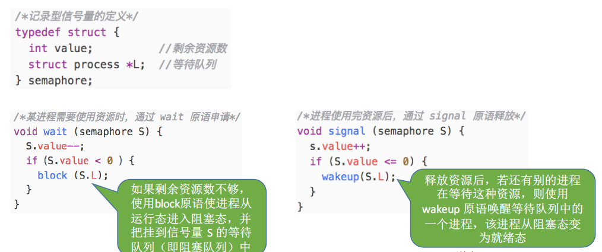
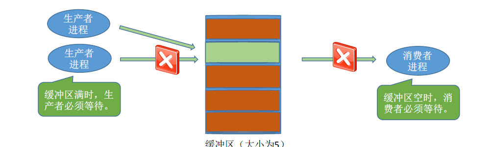

# 同步和互斥

1. 什么是进程同步？

   进程具有异步性的特征。异步性指的是个并发执行的进程以各自独立的、不可预知的速度向前推进。操作系统需要提供**进程同步机制**来实现需求。

   管道通信例子：

   读进程和写进程并发运行，由于并发必然导致异步性，因此两个操作的先后顺序是不确定的，但是在实际应用中，必须按照写数据到读数据的顺序完成，就需要同步机制了。

   同步也叫**直接制约关系**，他是指为完成某种任务而建立的**两个或者多个进程**，这些进程因为需要在**某些位置上协调他们的工作次序而产生的制约关系**。进程间的直接制约关系就是源于合作。

2. 什么是进程互斥？

   一个时间段内只**允许一个进程使用的资源 称为临界资源**，许多物理设备（摄像头、打印机）。还有一些变量、数据、内存缓冲区等都属于临界资源。

   对临界资源的访问必须**互斥进行**，互斥也叫**间接制约关系**。进程互斥指当一个进程访问某**临界资源**的时候，另一个想要访问该临界资源的进程**必须等待**。当前访问临界资源的进程访问结束，释放该资源后，另一个进程才能访问该临界资源。

   注意：临界区是进程中访问临界资源的**代码段**、进入区和退出区是负责**实现互斥的代码段**。

   - 进入区：负责检查是否可以进入临界区，若可进入，则应设置正在访问临界资源的标志，以阻止其他进程同时进入临界区。
   - 临界区：访问资源的代码段
   - 退出区：负责解除标志的
   - 剩余区：做其他处理

   临界资源互斥访问规则：

   1. 空闲让进：临界区空闲的时候可以允许一个请求进入临界区的进程立即进入临界区
   2. 忙则等待：当已有进程进入临界区时，其他试图进入临界区的进程需要等待
   3. 有限等待：对请求访问的进程，应该保证其在有限的时间内进入临界区
   4. 让权等待：当进程不能进入临界区时，应该立即释放处理机，防止进程忙等待。

总结：

## 进程互斥的软件实现方式

需要了解算法的思想原理以及在进入区和退出区的工作，以及优缺点。

### 单标志法

- 算法思想：两个进程在**访问完临界区**会把使用临界区的权限转交给另一个进程，也就是说**每个进程**进入临界区的**权限只能被另一个进程赋予。**

  

  主要问题：只有当前允许进入临界区的进程在访问了临界区后，才会修改turn的值，对于临界区的访问，一定会按照p0-1-0-1这样轮流访问。如果此时允许进入临界区的进程是P0，而P0一直不访问临界区，那么此时虽然临界区空闲，但是并不允许P1访问。

  **也就是说单标志法存在的主要问题是：违背了空闲让进的原则**

### 双标志先检查

- 算法思想：设置一个布尔型数组flag[]，**数组中的各个元素用来标志进程想进入临界区的意愿**，，比如flag[0]=true表示0号进程需要进入临界区，每个进程进入临界区之前都需要检查当前有无别的进程进入临界区，如果没有就把自身标志设为true，之后开始访问临界区。

  

  如果按照152637顺序执行：会同时访问临界区。

  因此，双标志先检查法的主要问题是，**违反了”忙则等待“原则**

  原因在于，进入区的检查和上锁，两个处理并不是一气呵成的。检查之后，上锁前可能发生进程切换。

### 双标志后检查

- 算法思想：先上锁，后检查

  

  如果按照1526的顺序执行，都无法进入临界区。

  因此双标志后检查虽然解决了忙则等待问题，但是违背了**空闲让进和有限等待**原则。会因个进程都长期无法访问临界区而**产生饥饿**现象。

  两个进程都争着进入临界区，但是谁也不让谁，最后谁都无法进入临界区。

### Peterson算法

- 算法思想：在双标志的基础上加上一个退让的思路。

  

  存在问题：未遵循让权等待原则。（也就是说无法进入临界区的进程不会退让处理机）

## 进程互斥的硬件实现方法

### 中断屏蔽方法

利用”开/关中断指令“实现（与原语实现思想相同，即在某进程开始访问临界区到结束访问为止都不允许被中断，也就不能发生进程切换，因此也不可能发生两个同时访问临界区的情况）

- 优点：简单高效
- 缺点：**不适合用于多处理机**；只适用于操作系统内核进程，不适合用户进程（因为开关中断指令需要在内核态运行，这组指令如果能让用户随意使用会很危险）

### TestAndSet（TS指令/TSL指令）

简称TS或者TSL（TestAndSetLock指令），TSL指令是**由硬件实现的**，执行的过程中不允许被中断，只能一气呵成。

​	

若刚开始lock是false，则TSL返回的old值就是false，while循环条件不满足，进入临界区，。若刚开始lock是true，则返回的old值为true，while循环条件满足，会一直循环，直到访问临界区的进程在退出区后进行解锁。

相比软件实现方式，TSL指令把上锁和检查的操作用硬件的方式变成了一气呵成的原子操作。

- 优点：实现简单，无需像软件一样严格检查是否有逻辑漏洞，适用于多处理机环境
- 缺点：不满足让权等待的原则，暂时无法进入临界区的进程会占用CPU并循环执行TSL指令，从而造成忙等。

### Swap指令（XCHG指令）

SWAP指令通过硬件方式实现，执行的过程中不允许被中断，只能一气呵成。

与TSL一致。

## 信号量机制

用户进程可以通过使用操作系统提供的**一对原语**对**信号量**进行操作，从而方便的实现了进程的互斥同步问题。

**信号量**其实是一个变量（可以是一个整数，也可以是更复杂的记录型变量），可以用一个信号量来**表示系统中某种资源的数量**。

**原语**是一种特殊的程序段，其**执行只能一气呵成，不可被中断**，原语是由**关中断/开中断指令**实现的。软件解决方案的主要问题是由”进入区的各种操作无法一气呵成“，因此如果能够把进入区、退出区的操作都用原语实现，使这些操作可以一气呵成，就能避免问题。

**一对原语**：wait(s)原语和signa(s)原语，原语可以理解为函数，括号内的信号量S是寒大虎调用时传入的一个参数。

wait\signa原语简称为PV操作

### 整型信号量

用一个**整数型变量**作为信号量，用来表示**系统中某种资源的数量。**

### 记录型信号量

整数型信号量可能造成忙等问题。而记录型信号量是用记录型数据结构表示的信号量。

这对原语可用于**实现系统资源的申请和释放。**

S.value表示系统中某资源的数量。

对信号量S的**一次P操作**意味着进程**请求一个单位的该类资源**，因此需要执行S.value--，表示资源数建一，当s.value小于0的时候表示该类资源已经分配完毕，因此进程应该**调用block原语进行自我阻塞**（当前运行的进程从运行态到阻塞态）。主动放弃处理机，并插入该类资源等待队列S.L中，所以，该机制**遵循了让权等待的原则**，不会出现忙等现象。

对信号量的一**次V操作**，意味着进程释**放一个单位的该类资源**，因此需要执行S.value++，表示资源数加一，若加一之后的**S.value<=0，表示依然有进程在等待该类资源，因**此需要**调用weakup原语唤醒等待该类资源的第一个进程（阻塞态到就绪态）**

## 用信号量机制实现进程互斥、同步、前驱关系

### 实现互斥

1. 分析并发进程的关键活动，划定临界区（比如说对临界资源打印机的访问就应该放在临界区）
2. 设置**互斥信号量**，mutex,**初始值为1**
3. 在临界区之前执行P(mutex)
4. 在临界区之后执行V(mutex)

注意：对不同的临界资源需要设置不同的信号量。

**PV操作必须成对出现。**

### 实现同步

进程同步：要让各并发进程有序推进。

1. 分析什么地方需要实现同步活动。及必须保证一前一后执行的两个操作。
2. 设置**同步信号量S**，初始为**0**
3. **在前操作之后执行V（S）**
4. **在后操作之前执行P(s)**

### 实现前驱

每一对进程前驱关系都是一个进程同步问题。

1. 要为**每一对前驱关系各设置一个同步变量**
2. **在前操作执行之后对应的同步变量执行V操作**
3. **在后操作之前执行对应的同步变量执行P操作**

## 同步互斥相关问题

### 生产者消费者问题

问题描述：

系统中有一组生产者进程和一组消费者进程，生产者进程每次生产一个产品放入缓冲区，消费者进程每次从缓冲区取出一个产品并使用（产品可以理解为某种数据）

生产者消费者共享一个初始为空、大小为N的缓冲区。

只有缓冲区没满时，生产者才能把产品放入缓冲区，否则必须等待

只有缓冲区不为空时，消费者才能取出产品，否则必须要等待

缓冲区是临界资源，各进程必须互斥的访问

## 管程

1. 为什么要引入管程？

   信号量存在编写程序困难易出错的问题。

2. 管程的定义以及基本特征

   管程是一种特殊的软件模块，有以下部分组成：

   - 局部于管程的共**享数据结构**说明
   - 对该数据结构**进行操作的一组过程**
   - 对局部于管程的共享数据设置初始值的语句
   - 管程有一个名字

   基本特征：

   - 局部于管程的数据只能被局部于管程的过程所访问
   - 一个进程只有通过调用管程内的过程才能进入管程访问共享数据
   - **每次仅允许一个进程在管程内执行某个内部过程**

3. 拓展一：用管程解决生产者消费者问题？

4. 拓展二：Java中类似于管程的机制

   synchronized关键字。

  