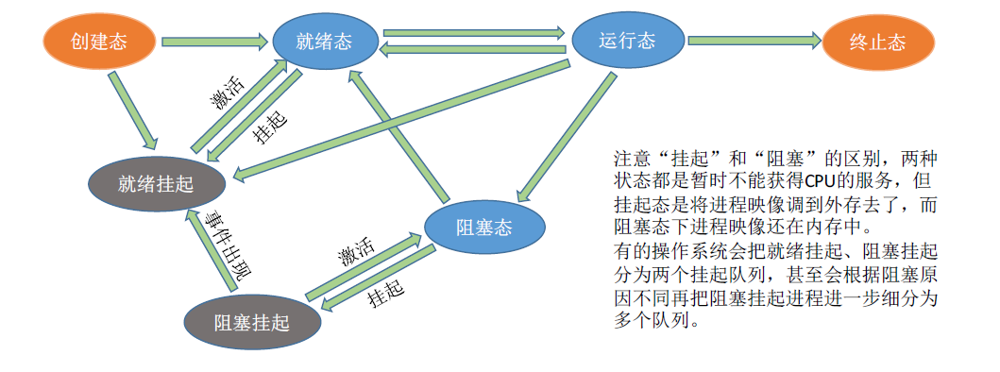

# 调度算法

## 基本概念

当有一堆任务需要处理，**但是资源有限**，这些事情**没法同时处理**。这就需要确定某种机制来**决定处理任务的顺序**，这就是调度需要研究的问题。

在**多道程序系统**中，进程的数量往往多于处理机的个数，这样并不能同时处理各个进程。

**处理机调度**就是从**就绪队列中按照一定的算法选择一个进程并将处理机分配给他运行以实现进程的并发执行。**

## 三个层次（作业、内存、进程调度）

1. 高级调度（作业调度）：由于内存空间有限，有时无法将用户提交的作业全部放入内存中，因此就需要确定某种规则来决定将作业调入内存的顺序。
   - 高级调度需要按照一定的原则从外存上处于**后备队列**的作业中挑选一个或多个作业，给他们分**配内存等资源，**并**建立相应的进程（PCB）**，使得他们**获取竞争处理机的权利。**
   - 高级调度是**外存与内存之间的调度**，每个作业只能调入一次调出一次，作业**调入时会建立相应的PCB**，作用调出时会撤销PCB。高级调度主要时调入的问题，因为只有调入的时候才需要由操作系统确认，但是调出的时机必然是作业运行结束后才调出。
2. 中级调度（内存调度）：引入了虚拟存储技术之后，可以将暂时不能运行的进程调至外存等待，等他重新具备了运行条件而内存又有空闲的时候，在重新调入内存。（**为了提高内存的利用率和系统的吞吐量**）
   - 暂时调到外存的进程状态为**挂起状态**。需要注意：	**PCB不会一起到外存，而是常驻内存**。PCB会记录进程数据在外存中的存放位置，进程状态等信息，操作系统通过内存中的PCB来保持各个进程的监控、管理。被挂起的进程PCB会被**放到挂起队列中。**
   - 中级调度（内存调度）：就是要决定哪个处于挂起状态的进程重新调入内存。
   - **一个进程可以多次被调出调入内存，因此中级调度的频率比高级调度的频率高。**
3. 低级调度（进程调度）：主要任务是按照某种方法和策略从就绪队列选取一个进程将处理机分配给他。
   - 进程调度是操作系统中**最基本的一种调度，在一般的操作系统中都必须配置进程调度，频率很高，一般几十毫秒一次。**

## 三个级别调度的对比与联系

|                      | 要做什么                                                     | 调度发生时机           | 发生频率 | 对进程状态影响     |
| -------------------- | ------------------------------------------------------------ | ---------------------- | -------- | ------------------ |
| 高级调度（作业调度） | 按照某种规则，从后备队列中选择合适的作业将其调入内存，并为其创建进程。 | 外存->内存（面向作业） | 最低     | 无->创建态->就绪态 |
| 中级调度（内存调度） | 按照某种规则，从挂起队列中选择合适的进程将其数据调回内存     | 外存->内存（面向进程） | 中等     | 挂起态->就绪态     |
| 低级调度（进程调度） | 按照某种规则，从就绪队列中选择一个进程为其分配处理机         | 内存->CPU              | 最高     | 就绪态->运行态     |

## 进程的挂起态与七状态模型

暂时调到外存的进程状态为挂起状态，suspend。

挂起态进一步分为**就绪挂起和阻塞挂起。**

挂起与阻塞的区别在于：

1. 都是暂时不能获取CPU服务，但是挂起状态的进程影像调到外存了，阻塞状态的的进程映像还在内存中

## 进程调度的时机以及切换与调度方式