# 进程、线程

## 进程的定义、组成、组织形式以及特征

早期的计算机只支持单道程序，程序就是一个指令序列。

引入了多道程序技术后，为了方便操作系统管理，完成各程序并发执行，引入了**进程与进程实体的概念**，**PCB**、**程序段**、**数据段**三部分构成了**进程实体。**

系统为**每个运行的程序配置一个数据结构**，成为**进程控制块（PCB）**，用来描述进程的各种信息。**PCB是进程存在的唯一标识。**

进程的定义：

1. 进程是程序的一次**执行过程**
2. 进程是一个程序及其数据在处理机上顺序执行时所发生的活动。
3. 进程是具有**独立功能的程序**在**数据集合上运行的过程，是系统进行资源分配和调度的一个独立单位**

引入了进程实体的概念后，进程可以看作是进程实体的运行过程，是系统进程资源分配和调度的一个独立单位。

进程实体是静态的，进程是动态的。

进程的组成：

1. PCB：操作系统通过PCB来管理进程，因此PCB中应该包含操作系统对其进行**管理所需的各种信息**。
   - 当进程被创建时，操作系统会为该进程分配一个唯一的、不重复的ID，用于区分不同的进程PID，所以PID是进程的唯一标识码。
   - 除此之外还有一个用户标识符UID
   - 当进程需要切换时，需要把进程当前的运行情况记录保存在PCB中，如程序计数器的值表示了当前程序执行到哪一句
   - PCB中还包括了进程的控制管理信息比如进程的优先级与状态，资源分配清单，各种寄存器的值。
2. 程序段：程序代码存放的位置
3. 数据段：程序运行时使用产生的运算数据就存放在数据段内。

### 组织形式

进程的**组成**说的是一个进程**内部有哪些部分构成**，但是**组织形式**说的是**多个线程之间的组织方式问题**。

1. 链接方式：按照进程**的状态**将PCB分为多个队列，操作系统**持有各个队列的指针**（阻塞队列有多个）

   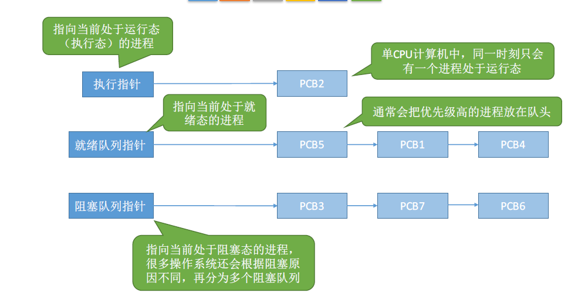

2. 索引方式：根据进程**状态**的不同，**建立几张索引表**，操**作系统持有指向各个索引表的指针**

   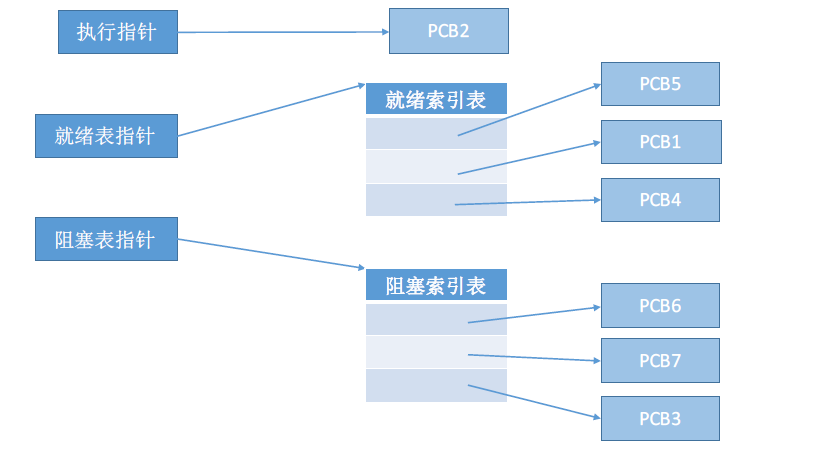

### 特征

进程与程序是截然不同的概念，具有以下五个特征：

1. 动态性：动态性是进程最基本的特性，进程是程序的一次执行过程，是动态的产生变化和消亡的。
2. 并发性：内存中有多个进程实体，各个进程可以并发执行。
3. 独立性：进程是可以独立运行、独立获得资源、独立接受调度的基本单位
4. 异步性：各个进程是独立的，不可预知的速度向前推进，操作系统要提供**进程同步机制**来解决异步问题。
5. 结构性：每个进程都会配置一个PCB，结构上看进程有程序段、PCB、数据段组成。

## 进程的状态与转换

进程包括三种基本的状态：运行状态、就绪状态、阻塞状态，除此之外还有创建状态、终止状态。进程是程序的一次执行，在这个执行过程中，有时进程正在被CPU处理，有时有需要等待CPU服务，所以进程的状态是会变化的。

- 运行态：占有CPU，并在CPU上运行，在单核处理机环境下每一个时刻最多只有一个进程处于运行状态。
- 就绪态：已经具备了运行条件但是没有获取到CPU的服务，暂时不能运行，一旦获得处理机便可以直接运行
- 阻塞态：因为等待某一事件而暂时不能运行，为了提高CPU利用率，需要等待其他资源都分配到位了才能得到CPU的服务
- 创建态：进程正在被创建，操作系统为进程**分配资源初始化PCB**
- 终止态：进程运行结束，或者由于BUG导致进程无法继续执行下去，此时操作系统需要完成撤销进程的相关工作，完成**回收资源以及撤销PCB的工作。**

进程状态之间可以有如下的转换：（阻塞不能到运行，因为需要资源就绪才能获取CPU，就绪不能到阻塞因为阻塞状态时需要在运行时候主动请求的）

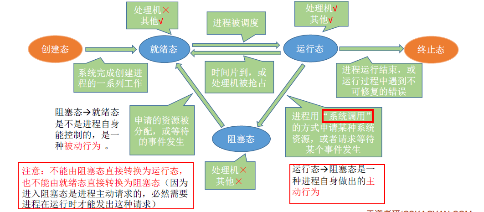

1. 就绪态->运行态：进程被调度
2. 运行态->就绪态：时间片到，或者CPU被其他高优先级的进程抢占
3. 运行态->阻塞态：等待系统资源分配，或者等待某个事件的发生（主动行为）
4. 阻塞态->就绪态：资源分配到位等待事件的发生（被动行为）
5. 创建态->就绪态：系统完成创建进程相关的工作
6. 运行态->终止态：进程运行结束，或者运行过程中遇到不可修复的错误

## 进程控制

### 基本概念

- 什么是进程控制？

  进程控制的主要功能是对系统中所有的**进程实时有效的管理**，具有创建新进程撤销已有进程、实现进程状态切换等功能。简单来说就是实现进程状态的转换。

- 如何实现进程控制？用原语实现

  用原语实现进程控制。原语的特点是**执行期间不允许中断**，只能一气呵成。这种不可以被中断的操作就是**原子操作**。原语中采用“**关中断指令**”和“**开中断指令**”实现。原语是运行在核心态的，关中断指令以及开中断指令权限很大，也是只能在核心态下执行的特权指令。

  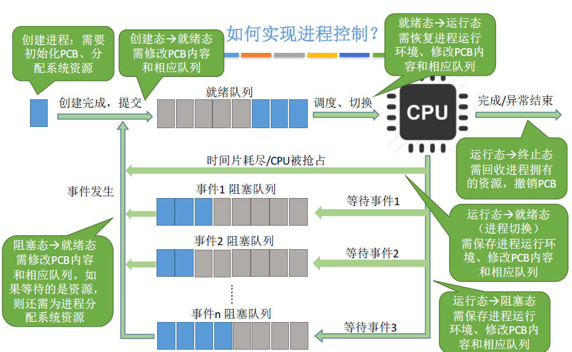

### 进程控制相关的原语

首先，进程控制会导致进程状态的切换所以都会做以下三个事情：

- 更新PCB中的信息，比如说修改进程状态标志，将运行环境保存到PCB中，从PCB中恢复运行环境
  - 所有的进程控制原语一定会修改进程状态标志
  - 剥夺当前运行进程的CPU会保存其运行环境
  - 某进程开始运行前必然要恢复前期运行环境
- 将PCB插入到合适的队列，比如说就绪队列阻塞队列等
- 分配以及回收资源

1. 进程的创建
2. 进程的终止：
   1. 从PCB集合中找到终止进程的PCB
   2. 如果进程正在运行，立即剥夺CPU，将CPU分配给其他进程
   3. 终止其所有子进程
   4. 将该进程的所有资源归还给父进程或者操作系统
   5. 删除PCB
3. 进程的阻塞：（阻塞和唤醒是成对出现的）
   1. 找到要阻塞的进程对应的CPU
   2. 保护进程运行现场，将PCB的状态信息设置为“阻塞态”，暂时停止进程运行
   3. 将PCB插入相应事件的阻赛队列
4. 进程的唤醒：
   1. 在事件等待队列中寻找到PCB
   2. 将PCB从等待队列移除，设置进程为就绪态
   3. 将PCB插入到就绪队列等待被调度
5. 进程的切换（运行与其他的切换）：
   1. 将运行环境信息存入PCB
   2. PCB移入相应队列
   3. 选择另一个进程执行，并且更新PCB
   4. 根据PCB恢复新的进程所需要的运行环境

## 进程通信

进程通信主要有共享存储、消息传递以及管道通信三大类，而共享存储包括基于数据结构的共享以及基于存储区的共享，消息传递则分为直接通信方式与间接通信方式。

进程间的通信就是指进程之间的信息交换。进程是分配系统资源的单位，因此各**个进程**拥有的**内存地址空间**相互独立。为了保证安全，**一个进程是不可以直接访问其他进程的地址空间**。但是进程之间有需要信息交换，所以为了进程之间的安全通信就引入了一些方法。

### 共享存储

两个进程对于共享空间的访问必须是**互斥**的。

1. 基于**数据结构**的共享：比如共享空间里面只能放一个长度为10的数组，这种共享方式**速度慢，限制多，**是**低级**的通信方式。
2. 基于**存储区**的共享：在**内存中划出一块共享存储区**，数据的形式和存放位置都有进程控制而不是操作系统，相比之下速度更快，是一种高级的通信方式。

### 管道通信

“管道”指的是用于连接读写进程的一个共享文件，又名pipe，其实就是在内存中开辟的一个固定大小的缓冲区。

需要注意以下：

1. 管道只能采用**半双工的通信**，某一段时间内只能实现单向的通信，如果要实**现双向同时通信，则需要设置两个管道。**
2. 各个进程需要**互斥**的访问管道
3. 数据以字符流的形式写入管道，当**管道写满**时，写进程的**write()系统调用将被阻塞**，等待读进程将数据取走，当读进程将数据全**部取走后**，此时读进程的r**ead()系统调用将会被阻塞**
4. 如果没有写满就不允许读，如果没有完全取走就不允许写。（写与读只能存在一个）
5. 数据一旦被读出，就会从管道中被抛弃，意味着**读进程最多只能有一个**，否则可能会有读错数据的情况。

### 消息传递

进程之间的数据交换以**格式化的信息**message为单位。进程**通过操作系统提供的发送消息接收消息两个原语进行数据交换。**

消息的格式：分为消息头和消息体，消息头包括发送进程ID以及接受进程ID，消息类型，消息长度等信息

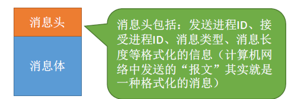

直接通信方式：消息直接挂到接受进程的消息缓存队列中。

间接通信方式：消息先发到中间实体（信箱）中。

## 线程的概念以及多线程模型

### 什么是线程，为什么需要引入线程？

为了**增加并发度**，就引入了线程，线程成为了程序执行的最小单位。

可以把线程理解为**轻量级的进程**，线程是一个**基本的CPU执行单元**，也是程序执行流的最小单位。

引入线程之后，不仅仅是进程之间可以实现并发，进程的**各个线程之间也可以实现并发**，进一步**提升了系统的并发度**，使得一个进程内也可以并发处理各种任务。

引入线程后，进程只作为除了CPU之外的系统资源的分配单位，线程值作为处理机的分配单位。

### 引入线程机制后，有什么变化？

1. 资源分配、调度：
   - 传统的进程机制中进程时资源分配调度的基本单位
   - 引入线程后，进程是资源分配的基本单位，线程是调度的基本单位
2. 并发性：
   - 传统进程机制中只能进程并发
   - 引入了线程后，线程之间也能并发，提高了并发度
3. 系统开销：
   - 传统的进程机制需要切换进程的运行环境，系统开销很大
   - 线程之间并发，如果是同一个进程内的线程切换，则不需要切换进程环境，系统开销小
   - 引入线程后，并发带来的系统开销小

### 线程有哪些重要的属性

1. 线程是计算机调度的基本单位
2. 多CPU计算机中各个线程可以使用不同的CPU
3. 每个线程都有一个线程ID、线程控制块（TCB）
4. 线程也有**就绪阻塞运行**三种状态。
5. 线程几乎不拥有系统资源
6. 同一个进程的不同线程共享进程之间的资源
7. 由于共享了地址空间所以一个进程内部的线程通信不需要系统的干预
8. 同一个进程之间的线程切换不会引起进程切换
9. 不同进程的线程切换会引起进程切换
10. 切换同进程内的线程开销小
11. 切换不同进程内的线程开销大

### 线程的实现方式

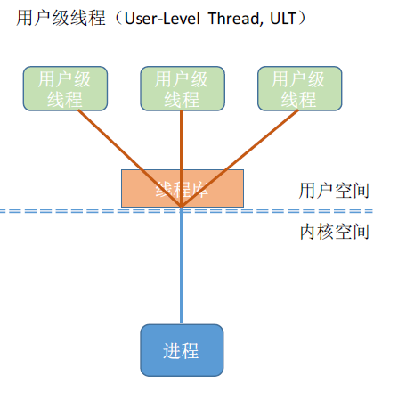

用户级线程由应用程序通过**线程库实现。**

所有的线程管理工作都有**应用程序负责**

用户级别线程中线程可以在**用户态即可完成**，无需操作系统干预

在用户看来，是由多个线程但是在操作系统内核看，并没有意识到线程的存在。也就是**用户级线程只是从用户角度能够看到的线程。**

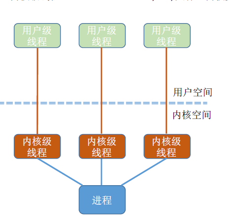

内核级别线程的管理工作是由操作系统内核完成，线程的调度切换等工作都由内核负责，因此内核级别线程的切换必然需要在**核心态才**能完成。

也就是**内核级别线程是系统内核视角才能看到的线程。**

（因为只有内核级别的线程由操作系统看到，所以内核级的线程才是处理的的基本分配单位）

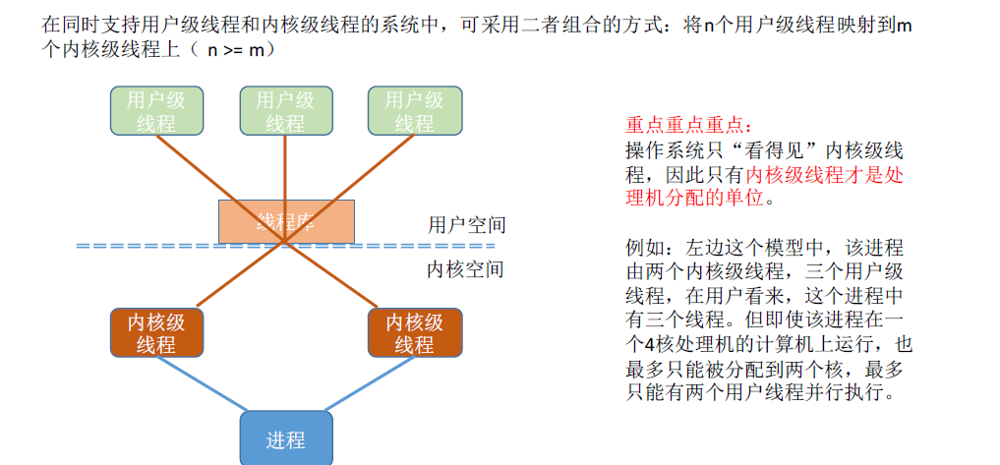

### 多线程模型

1. 多对一模型：多个用户级别线程映射到**一个内核级别线程**。**每个用户进程只对应一个内核级别线程**

   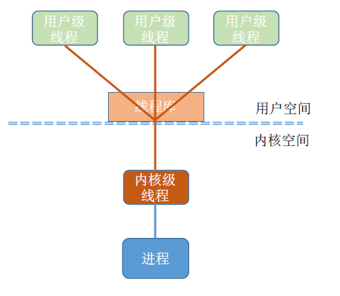

   - 优点：用户级线程的切换在用户空间就可完成，**不需要切换核心态**，线程管理的系统**开销小，效率高**
   - 缺点：当一个用户线程被阻塞之后，整个进程都会被阻塞，**并发度不高**。多个线程**不能在多核处理机上并行运行。**

2. 一对一模型：一个用户及其线程映射到一个内核级别线程，**每个用户进程有与用户级线程同数量的内核级线程。**

   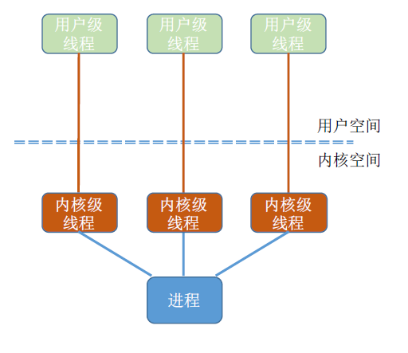

   - 优点：当一个线程被阻塞后，其他的线程还可以继续执行，并发能力强。**多线程可以在多核处理机上并发执行。**
   - 缺点：一个用户进程会占用过多的内核级线程，线程切换由操作系统完成，需要切换内核态，线程管理的**开销大，成本高。**

3. 多对多模型：n用户线程映射到m个内核级别线程n>=m。每个用户进程对应m个内核级线程。

   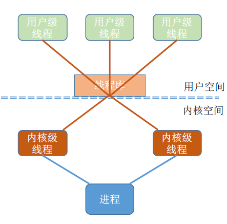

   克服了多对一模型并发度不高的缺点，又克服了一对一模型中一个用户进程占用太多内核级线程，开销太大的缺点。

   